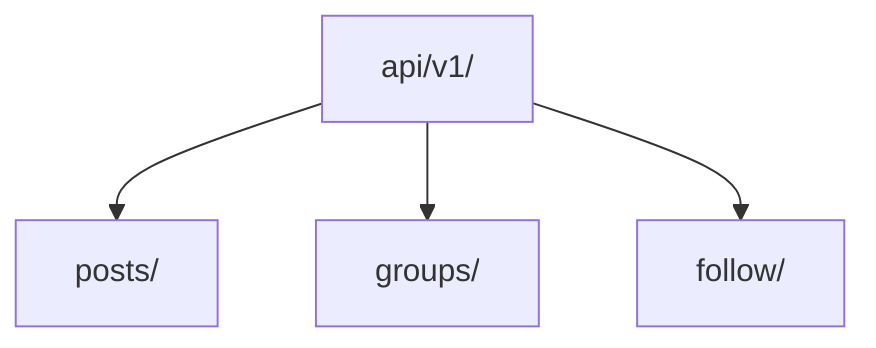
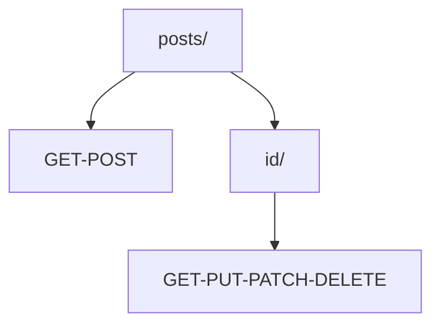
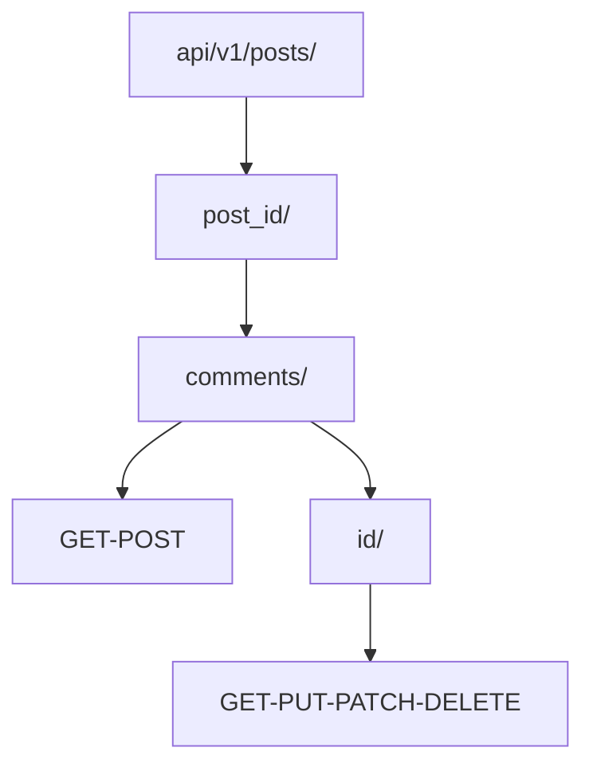
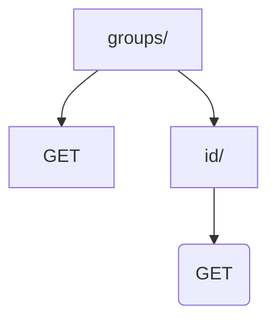
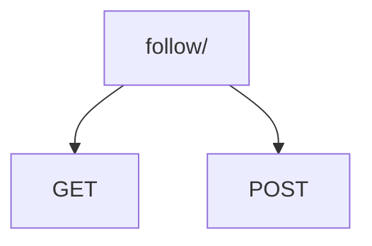

# SnapJournal(api) 📡

[](https://www.python.org/)
[](https://flake8.pycqa.org/)
[](https://www.djangoproject.com/)
[](https://pillow.readthedocs.io/en/stable/)
[](https://www.django-rest-framework.org/)
[](https://github.com/davesque/django-rest-framework-simplejwt)
[](https://github.com/jpadilla/pyjwt)
[](https://github.com/sunscrapers/djoser)
[](https://github.com/kluevevga/SnapJournal-api/blob/master/LICENSE)
[](https://github.com/kluevevga/SnapJournal-api)

## О проекте "SnapJournal" 📖

Проект "SnapJournal" - это уникальная платформа для ведения личных микроблогов и журналов. Основанный на мощном
фреймворке Django-rest-framework, "SnapJournal" предоставляет REST API backend сервис, который позволяет пользователям
создавать и управлять своими текстовыми и визуальными записями. "SnapJournal" разработан с акцентом на интуитивном
интерфейсе и легкости в использовании, а также предоставляет возможность добавлять как текстовые, так и мультимедийные
записи. Это идеальное решение для тех, кто ищет место, где можно свободно и креативно делиться своими мыслями и идеями.

# SnapJournal(api) 🔌

SnapJournal(api) - это REST API сервис, который расширяет функциональность платформы SnapJournal, позволяя пользователям
создавать и управлять своим контентом, отправляя CRUD запросы в формате JSON и таким образом взаимодействуя с базой
данных "SnapJournal." Это предоставляет пользователям мощный инструмент для управления их контентом в системе.

### 🔑 Ключевые особенности

- **🔐 Авторизация и безопасность**: В проекте реализована надежная система аутентификации на основе JWT токенов,
  обеспечивая безопасное взаимодействие пользователей с платформой.

- **📖 Документация**: API проекта снабжен документацией в формате OpenAPI, что делает его легким в использовании и
  понимании.

- **🔒 Защита данных**: Для обеспечения целостности и безопасности данных, проект использует сериализаторы, которые
  фильтруют и проверяют информацию, предотвращая внесение некорректных данных в систему. Для хранения данных
  используется SQLite база данных, а использование Django ORM обеспечивает дополнительную безопасность от SQL инъекций.

- **🛠️ Функциональность API**: Аутентифицированным пользователям разрешено добавление постов и комментариев, а также
  изменение и удаление своего контента; в остальных случаях доступ предоставляется только для чтения.
  Эндпоинт `/follow/` доступен только для аутентифицированных пользователей.

Этот проект, "SnapJournal(api)," обеспечивает мощное и безопасное API для управления данными и взаимодействия с
контентом пользователей и является важной частью платформы "SnapJournal."

## 👷‍♂️ Установка 🏗️

### Клонирование проекта

Для начала, клонируйте проект "SnapJournal-api" с помощью следующей команды:

```shell
git clone https://github.com/kluevevga/SnapJournal-api.git
```

### Установка виртуальной среды 🧟‍♂️

Далее создайте виртуальное окружение:

```shell
python3 -m venv venv
```

### Активация виртуальной среды

Активируйте виртуальное окружение в зависимости от вашей операционной системы:

**🪟 Windows (PowerShell):**

```shell
venv\Scripts\Activate
```

**🪟 Windows (Git Bash):**

```shell
source venv/Scripts/activate
```

**🐧 Linux (Bash):**

```shell
source venv/bin/activate
```

### Установка зависимостей 📦 

Установите необходимые зависимости из файла `requirements.txt`:

```shell
pip3 install -r requirements.txt
```

## Запуск сервера 🤖

Перейдите в папку с проектом:

```shell
cd SnapJournal-api/
```

Выполните миграции:

```shell
python3 manage.py migrate
```

Запустите сервер:

```shell
py manage.py runserver
```

## Диаграммы эндпоинтов 📊

Здесь представлены диаграммы эндпоинтов для API проекта "SnapJournal-api":

> **Общий вид**



> **Эндпоинт posts/**



> **Эндпоинт post -> comments/**



> **Эндпоинт groups/**



> **Эндпоинт follow/**



## Лицензия 📜

Этот проект распространяется под лицензией `MIT`. Дополнительную информацию можно найти
в [LICENSE](https://github.com/kluevevga/SnapJournal-api/blob/master/LICENSE).
